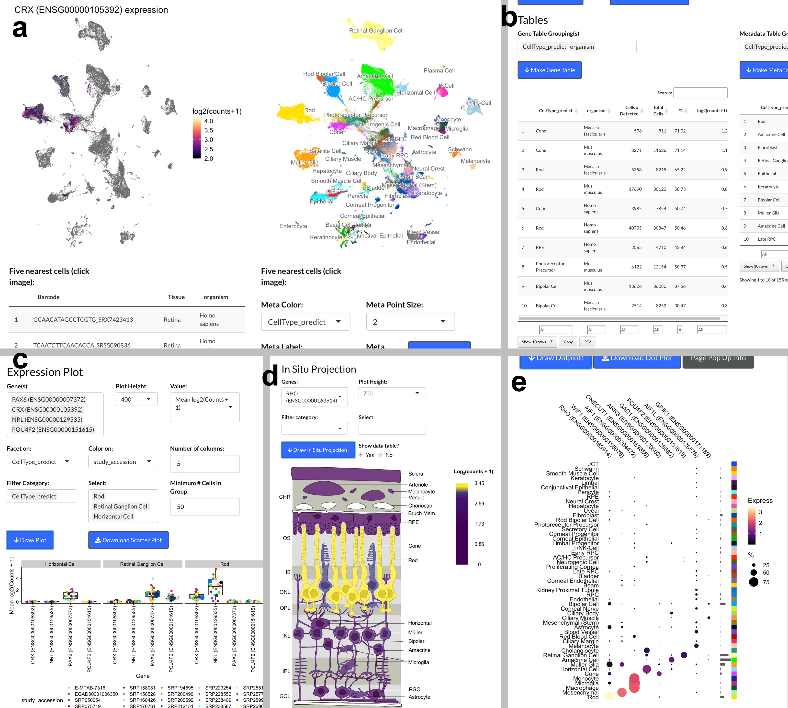

```{r Setup..., message=FALSE, warning=FALSE, include=FALSE}
#knitr::opts_chunk$set(fig.pos = 'p') # Places figures on their own pages
knitr::opts_chunk$set(out.width = '100%', dpi=300)
library(tidyverse)
library(citr)
library(cowplot)
library(ggrepel)
library(colorspace)
library(flextable)
library(captioner)
library(glue)
library(tictoc)
#tic()()
data_dir_vGiga <- '/Volumes/McGaughey_S/data/scEiaD/'
data_dir_vPLAE <- '/Volumes/McGaughey_S/data/scEiaD_2022_02/'
#data_dir_vGiga <- '~/data/scEiaD_gigascience/'
#data_dir_vPLAE <- '~/data/scEiaD_2022_02/'
# setup caption-ing
fig_cap <- captioner("Figure")
supFig_cap <- captioner("Supplemental Figure")
tab_cap <- captioner("Table")
supTab_cap <- captioner("Supplemental Table")

library(pool)
library(RSQLite)
meta_filter_v0 <- fst::read_fst(glue("{data_dir_vGiga}/paper_data/2021_03_17_meta_filter.fst")) %>% 
  
  mutate(CellType_predict = case_when(CellType_predict == 'AC/HC_Precurs' ~ 'AC/HC Precursor',
                                      TRUE ~ CellType_predict),
         CellType= case_when(CellType == 'AC/HC_Precurs' ~ 'AC/HC Precursor',
                             TRUE ~ CellType))

meta_filter <- fst::read_fst(glue("{data_dir_vPLAE}/meta_filter.fst")) %>% filter(study_accession != 'Bharti_Nguyen_iRPE_2D_3D') %>% 
  
  mutate(CellType_predict = case_when(CellType_predict == 'AC/HC_Precursor' ~ 'AC/HC Precursor',
                                      TRUE ~ CellType_predict),
         CellType= case_when(CellType == 'AC/HC_Precursor' ~ 'AC/HC Precursor',
                             TRUE ~ CellType),  
         Tissue = case_when(grepl('Iris', Tissue) ~ 'Iris',
                            TRUE ~ Tissue),
         Tissue = case_when(grepl('^RPE|^Choroid', Tissue) ~ 'RPE-Choroid',
                            TRUE ~ Tissue),
         Citation = case_when(study_accession == 'OGVFB_Hufnagel_iPSC_RPE' ~ 'Swamy VS, Fufa TD, Hufnagel RB, McGaughey DM Building the Mega Single Cell Transcriptome Ocular Meta-Atlas Gigascience 2021 Oct 13;10(10)',
                              TRUE ~ Citation),
         PMID = case_when(study_accession == 'OGVFB_Hufnagel_iPSC_RPE' ~ '34651173',
                          TRUE ~ PMID),
         study_accession = case_when(study_accession == 'OGVFB_Hufnagel_iPSC_RPE' ~ 'SRP329495',
                                     TRUE ~ study_accession))


load('data/diff_data_pull.Rdata') # from src/diff_data_pull.R

scEiaD_2020_v00 <- pool::dbPool(RSQLite::SQLite(), dbname =  glue('{data_dir_vGiga}/MOARTABLES__anthology_limmaFALSE___5000-transform-counts-universe-batch-scVIprojectionSO-8-0.1-50-5.sqlite'))
scEiaD_2020_v01 <- pool::dbPool(RSQLite::SQLite(), dbname =  glue('{data_dir_vPLAE}/MOARTABLES__anthology_limmaFALSE___4000-counts-universe-study_accession-scANVIprojection-15-5-0.1-50-20__pointRelease01.sqlite'))


#toc()
```


# Introduction
  
  Single cell transcriptomics of the retina date to the early 2000s when researchers [@hagstrom_cone_2000; @jabs_evidence_2000; @li_localization_2004; @lindqvist_single_2002-1; @reid_retinoschisin_2003] used RT-PCR approaches to amplify select transcripts in small numbers of cells. Later, researchers used microarray platforms to analyze a broader array of transcripts [@cherry_development_2009; @gustincich_gene_2004-1; @kim_identification_2008-1; @roesch_transcriptome_2008; @trimarchi_individual_2008; @trimarchi_molecular_2007-1; @wahlin_method_2004]. The modern era of single cell transcriptomics is marked by the introduction of droplet-based technologies, which enabled quantitation of thousands of cells in a single experiment; in Macoksko et al. the adult mouse retina was profiled [@klein_droplet_2015; @macosko_highly_2015]. The commercialization of the droplet approach has enabled broad access to this technology and the ocular community have responded by publishing several dozen ocular studies using single cell transcriptome technology since Macosko publication. 
  These publications's foci includes, but is not limited to, studying developmental transcriptomic dynamics, identifying genes to distinguish core cell types, proposing finer gradations of cell types within existing categories, and comparing ocular transcriptomes between organisms. Independent querying of these datasets requires a labrious series of steps. Briefly, one would have to identify the relevant publication, find the associated data deposit, download the cell - count matrix, find the cell label table (and optionally the t-SNE or UMAP coordinates), and then load the data into R or python to run the desired queries. If one desired to compare *across* publications, then one would also have to normalize the cell type labels and would likely have to re-quantify the counts with consistent bioinformatic tooling and run a batch-effect removal algorithm. It is desirable, perhaps even necessary, to use multiple datasets to assess gene expression to confirm whether a gene expression is consistent and reproducible. Reliance on a single dataset can be problematic as there can be technical issues - for example the large consortium dataset GTEx has persistent contamination from highly expressed genes across tissues [@nieuwenhuis_consistent_2020]. 
  Web-based resources to query gene expression are powerful means to democratize access to large datasets as the computationally intensive steps above can be run once and then shared to anyone with a internet connected device. Single cell RNA-seq web resources that contain ocular tissues include the UCSC Cell Browser, Tabula Muris, PanglaoDB, and the Protein Atlas [@franzen_panglaodb_2019; @karlsson_singlecell_2021; @noauthor_single-cell_nodate; @speir_ucsc_2021]. Primary limitations to these resources include incomplete cell type labels and sample metadata that make ocular focused queries challenging. In contrast to these, the Spectacle resource is an ocular specific web app which has curated over a million cells from dozens of independent resources [@voigt_spectacle_2020]. However each data deposit is independently processed, which makes cross study queries difficult. We recently created a unified ocular data resource which placed dozens of independent single-cell RNA-seq ocular and non-ocular datasets in a single combined space [@swamy_building_2021]. 
  To broaden the usage of this powerful database, we restructured the data into a custom sqlite-based database and built a reactive web application around it. As many new studies were published since our last data build, we re-ran the scEiaD pipeline in March of 2022. In aggregate we have collated `r meta_filter$study_accession %>% unique() %>% length()` studies across `r meta_filter$PMID %>% unique() %>% length()` publications, four species, and `r meta_filter$Tissue %>% unique() %>% length()` tissues. We hand-curated `r meta_filter$CellType %>% unique() %>% length()` cell types, totaling `r meta_filter %>% filter(!is.na(CellType)) %>% nrow()` cells and used those ground-truth labels as the basis for a machine learning-based algorithm which labels the remaining cells. Extensive quality control metrics were tuned and applied to remove lower quality cells. In the end, the single cell Eye in a Disk (scEiaD) database contains `r meta_filter %>% nrow()` cells and 1,509,179,347 non-zero gene/cell expression values. We demonstrate how this unified resource can be used to identify genes that consistently distinguish cell types across studies and species, genes which have species-specific expression cell type patterning, and finally propose genes XYZ that differentially expressed between the fovea and peripheral cones.  

# Methods

## scEiaD pipeline upgraded and the database re-built

The scEiaD pipeline is structurally the same as in Swamy et al. [@swamy_building_2021]. Very briefly, we collected the raw fastq files and quantified with the kallisto / bustools system [@melsted_barcode_2019; @melsted_modular_2019]. The quantified counts are merged into one matrix that is used for downstream processing with scvitools create a batch corrected lower dimensional space. and then into Seurat for quality control, clustering, and 2D UMAP visualization. We use our previous xgboost-based machine learning approach to transfer cell type labels to unlabelled cells [@swamy_building_2021].  

The following alterations were made: First, the cutoff to retain a cell was raised from 200 unique genes quantified to 300 Second, we use the DecontX algorithm [@yang_decontamination_2020] from the celda R package (version 1.9.2) to automatically remove ambient RNA contamination. Third, we altered the procedure for automatically aligning gene names across species (see below for details). Fourth, we use the scANVI (scvitools based) batch correction method, which leverages the known cell type labels in the batch correction process. 

Two custom cutoffs for the minimum required number of unique genes identified per cell were used for the E12 chicken data and the cornea dataset (SRP362101) as an abnormally high number of cells were returned from our default value of 250 (????). We set the cutoffs for these studies to be 1000 and 800, respectively, as these values resulted in approximately the same number of cells being returned as the authors reported in their papers. 

## Cross species gene alignment

As we have four species in scEiaD (*Gallus gallus*, *Macaca fascicularis*, *Mus musculus*, and *Homo sapiens*) that we unify, we must identify shared genes. We found homologs/orthologs by pulling from BioMart database "Ensembl Genes 105" and using *Homo sapiens* as the reference. We then selected orthologous gene names from *Gallus gallus*, *Macaca fascicularis*, and *Mus Musculus*. This generates a table linked by Ensembl gene IDs and gene names. We then use a full join on non-duplicated Ensembl IDs between mouse and human. As we noticed a small number of gene names failed to be linked in this manner we ran another join on the remaining non-aligned genes, using gene name. This procedure gave us 17,769 shared human and mouse genes. To align the other species we again joined on Ensembl gene ID, removing genes where one chicken or macaque gene aligned to multiple human/mouse genes. In cases where multiple chicken or macaque genes aligned to one human/mouse gene, then we aggregated the counts by sum. In cases where there was no corresponding chicken or macaque gene, we filled in zeros. After these steps we had, as expected, 17,769 genes. 

## Metadata curation

Every study brought into scEiaD was hand curated to identify unique biological samples, published paper ID (where available), organ, tissue (e.g. Cornea), source (iPSC based or tissue), single cell platform (e.g. 10Xv2, DropSeq, etc.). We also, where possible, annotated retina region (e.g. fovea), sex, and age or developmental stage. To import individual cell type labels (e.g. Rod, Muller Glia), we wrote custom code for each study that made this table available to link their cell type assignments back to the matching barcoded cell. We curated two types of cell type labels: "CellType" and "SubCellType" where the former is our normalized cell types taken from the published labels. We normalized names for CellType, for example changing "MG" to "Muller Glia" and also dropping more detailed cell type assignments like off and on bipolar cells for Bipolar Cells (as few studies went into this level). We did retain the original published (except for the broader name normalization) labels under SubCellType. 

## Differential gene testing

The scater::aggregateAcrossCells function was used to aggregate gene counts across species, study accession, and [category] where category was either Cluster, CellType, or CellType (Predict) assignments for a cell. If there were fewer than 50 cells in organism - study accession - category combination, they were discarded for the differential test. Any genes with a sum of 0 counts after aggregation were removed. The aggregated matrix was imported into DESeq2 using the DESeqDataSetFromMatrix function with the design given as "~study_accession + [category]". Contrasts were extracted either with the target category (e.g. "Cone") against all remaining or in a pair wise manner ("Cone" vs "Rod") with the DESeq2 "results" function. Genes were considered to be significantly differentially expressed if they have a padj less than $1 x 10^-5 and a abs(log2FoldChange) > 2. 


## scEiaD structure and web app optimization

The web app at plae.nei.nih.gov can display gene expression in only a few seconds across over a million cells. This speed is only possible due to custom data structures to optimize for data query efficiency. Like eyeIntegration's EiaD database, scEiaD is a sqlite database with tables for the core categories. This allows the app to initialize in about 30 seconds on a cloud server with memory usage under 8 GB. For the gene by cell expression matrix, the data was transformed into a "long" format where there are three columns: Gene, Cell Barcode, and Gene Count Value. This allows for cell - gene level queries to be completed, again with minimal memory usage, in under 0.5 seconds. To generate the aggregated information (in the Dot Plot, Expression Plot, and tables) we pre-calculated all queries by running a dplyr "group by" operation on all column fields. On user given query, the data is further aggregated to level request. This allows for complicated queries to complete in seconds rather than minutes. 

## Data reproducibility

The codebase for scEiaD is available at github.com/davemcg/scEiaD; the commit corresponding to this manuscript is XXXXXXX. There are three relevant Snakemake pipelines which were used to create scEiaD: SnakeQUANT, which was used to quantify the gene / cell expression from the raw fastq files, SnakePOP, which runs the multi-parameter integration methods, and SnakeSCEIAD, which uses the optimal parameters identified in SnakePOP to run the cell type machine learning and differential gene testing that is incorporated into the scEiaD sqlite database for the app. 

# Results

## New studies and improvements to the scEiaD database

Our first version of the single cell Eye is a Disk (scEiaD) database contained `r meta_filter_v0$study_accession %>% unique() %>% length()` studies, three species, `r nrow(meta_filter_v0)` cells, and `r meta_filter_v0$CellType_predict %>% unique() %>% length()` curated cell types [@swamy_building_2021]. We updated the scEiaD resource for the PLAE v0.91 web app in six important ways. First, we added a large chicken retina (*Gallus gallus*) studies. Second we added an ocular outflow tract dataset and two more cornea datasets to enhance coverage across the eye. Third, we added a human pan-body reference scRNA dataset to allow for non-ocular comparisons. Fourth, we used an *in silico* method to remove background gene contamination as we noticed persistent Rhodopsin expression in many non-photoreceptors cells (`r supFig_cap(name = 'decontX', display = 'cite')`). Fifth, we increased the cell retention cutoff for detected unique transcripts per cell from 200 to 300 (CHECK THIS), to improve the database quality. Sixth, we carried over and harmonized several common cell type labels from the Tabula Muris project to more easily provide non eye cell type comparisons.

After the dataset and quality control updates the scEiaD v2022-03-21 dataset now contains `r meta_filter$study_accession %>% unique() %>% length()` studies, four species, `r nrow(meta_filter)` cells, and `r meta_filter$CellType_predict %>% unique() %>% length()` curated cell types (`r fig_cap(name = 'scEiaD_data_overview', display = 'cite')`). This resource is only possible due to the publication of `r meta_filter$PMID %>% unique %>% length()` single cell resources that scEiaD draws from (`r supTab_cap(name = 'studies_table', display = 'cite')`). To recognize these papers, we make the first data table on the loading page of plae.nei.nih.gov list each of these studies along with a direct link to their citation, where possible. 

```{r scEiaD_data_overview, fig.height = 16, fig.width = 20, echo = F, message = F, fig.cap=scEiaD_data_overview_cap}

num1 <- meta_filter %>% filter(Organ == 'Eye') %>% pull(Tissue) %>% unique() %>% length()
num2 <- meta_filter %>% filter(Organ != 'Eye') %>% pull(Tissue) %>% unique() %>% length()
num3 <- meta_filter %>% filter(Organ == 'Eye') %>% pull(CellType) %>% unique() %>% length()
scEiaD_data_overview_cap <- fig_cap(name = 'scEiaD_data_overview', caption = glue::glue("Distribution of tissues and cell types in scEiaD. A. tabulation of the number of cells present across {num1} ocular and {num2} non-ocular tissues, B. Number of studies for each ocular tissue. C. Number of cells present across {num3} curated ocular-derived cell types. D. Proportion of cell types (predicted) across each study (split by species and tissue)."))

# organ
meta_filter <- meta_filter %>% mutate(organism = factor(organism, levels = meta_filter$organism %>% unique()))
a <- meta_filter %>%
  mutate(Organ = case_when(Organ == 'Eye' ~ 'Eye',
                           TRUE ~ 'Body'),
         Tissue = gsub('\\.|_', ' ', Tissue),
         Tissue = gsub("RPE$","RPE-Choroid", Tissue),
         Tissue = gsub(" and Aorta","", Tissue)) %>% 
  filter(Organ == 'Body') %>% 
  filter(Tissue != 'Brain Choroid Plexus') %>% 
  group_by(Organ, Tissue,organism, study_accession) %>%
  summarise(Count = n()) %>%
  ungroup() %>% 
  mutate(organism = factor(organism, levels = meta_filter$organism %>% unique())) %>% 
  ggplot(aes(x=Tissue,y=Count, fill = organism, group = organism)) +
  ylab('Number of Cells') +
  geom_bar(stat='identity', position = 'dodge') +
  cowplot::theme_cowplot() +
  coord_flip() +
  # scale_y_continuous(breaks = c(2500, 5000, 7500, 10000, 12500, 84000)) +
  # ggbreak::scale_y_break(c(13000, 82000)) +
  scale_fill_discrete(drop=TRUE,
                      limits = levels(meta_filter$organism)) +
  theme(legend.position = "none") +
  scale_y_continuous(expand = c(0, 0)) + 
  ylab('') + xlab('')

aa <- meta_filter %>% 
  filter(Tissue == 'Brain Choroid Plexus') %>% 
  group_by(Organ, Tissue,organism, study_accession) %>%
  summarise(Count = n()) %>%
  ungroup() %>% 
  mutate(organism = factor(organism, levels = meta_filter$organism %>% unique())) %>% 
  ggplot(aes(x=Tissue,y=Count, fill = organism, group = organism)) +
  ylab('Number of Cells') +
  geom_bar(stat='identity', position = 'dodge') +
  cowplot::theme_cowplot() +
  coord_flip() +
  scale_fill_discrete(drop=TRUE,
                      limits = levels(meta_filter$organism)) +
  theme(legend.position = "none") +
  scale_y_continuous(expand = c(0, 0)) + 
  ylab('') + xlab('')

# eye studies
b <-  meta_filter %>%
  mutate(Organ = case_when(Organ == 'Eye' ~ 'Eye',
                           TRUE ~ 'Body'),
         Tissue = gsub('\\.|_', ' ', Tissue),
         Tissue = gsub("RPE$","RPE-Choroid", Tissue),
         Tissue = case_when(Tissue == "Choroid" ~ 'RPE-Choroid',
                            TRUE ~ Tissue),
         Tissue = gsub(" and Aorta","", Tissue)) %>% 
  filter(Organ == 'Eye') %>% 
  group_by(Organ, Tissue,organism) %>%
  summarise(Count = n()) %>%
  ungroup() %>% 
  ggplot(aes(x=Tissue,y=Count, fill = organism, group = organism)) +
  ylab('Number of Cells') +
  geom_bar(stat='identity', position = 'dodge') +
  cowplot::theme_cowplot() +
  coord_flip() +
  theme(legend.position = "none") +
  scale_y_continuous(expand = c(0, 0)) +
  xlab('')

# eye studies samples
c <-  meta_filter %>%
  mutate(Organ = case_when(Organ == 'Eye' ~ 'Eye',
                           TRUE ~ 'Body'),
         Tissue = gsub('\\.|_', ' ', Tissue),
         Tissue = gsub("RPE$","RPE-Choroid", Tissue),
         Tissue = gsub(" and Aorta","", Tissue)) %>% 
  filter(Organ == 'Eye') %>% 
  select(Organ, Tissue,organism, study_accession) %>%
  unique() %>%
  group_by(Organ, Tissue, organism) %>% 
  summarise(Count = n()) %>%
  ungroup() %>% 
  ggplot(aes(x=Tissue,y=Count, fill = organism, group = organism)) +
  ylab('Number of Studies') +
  geom_bar(stat='identity', position = 'dodge') +
  cowplot::theme_cowplot() +
  coord_flip() +
  theme(legend.position = "none") +
  scale_y_continuous(expand = c(0, 0))  + xlab('')

# retina cell types
d <- meta_filter %>% filter(Organ == 'Eye') %>% 
  mutate(CellType_predict = case_when(is.na(CellType_predict) ~ 'Unlabelled', TRUE ~ CellType_predict)) %>% 
  group_by(CellType_predict, study_accession, organism) %>%
  summarise(Count = n()) %>% filter(Count > 10) %>% ungroup() %>% 
  ggplot(aes(x=CellType_predict,y=Count, fill = organism, group = organism)) +
  ylab('Number of Cells') +
  geom_bar(stat='identity', position = 'dodge') +
  cowplot::theme_cowplot() +
  coord_flip() + 
  scale_y_continuous(expand = c(0, 0)) + xlab('')


a_aa_b <- plot_grid(a + scale_y_continuous(guide = guide_axis(check.overlap = TRUE)),
                    aa + scale_y_continuous(guide = guide_axis(check.overlap = TRUE)),
                    b + scale_y_continuous(guide = guide_axis(check.overlap = TRUE)), 
                    ncol = 1, align = 'hv', rel_heights = c(10, 1.5,3.5), labels = 'a')
org_legend <- get_legend(d)
c_d <- plot_grid(c,d + theme(legend.position = "none"), rel_heights = c(3,10), ncol = 1, align= 'hv', axis = 'l',labels = c('b','c'))


# make E now

# map color as plae app does
categorical_columns <- c("Phase","batch","study_accession","library_layout","organism","Platform",
                         "Covariate","CellType","CellType_predict","TabulaMurisCellType","TabulaMurisCellType_predict",
                         "GSE","Summary","Design","Citation","PMID","Stage","cluster",
                         "Doublet","TechType", "SubCellType", 'subcluster', 'Age', "retina_region",
                         'Tissue','Organ', 'Source','sample_accession')
#"SubCellType" and subcluster are problems
meta_filter <- meta_filter %>% mutate(Age = as.character(Age), SubCellType = tidyr::replace_na(SubCellType, 'None'),
                                      subcluster = as.character(subcluster))


map_color <- function(column, meta_filter){
  master_colorlist <- c( pals::glasbey(), pals::alphabet(), pals::cols25()[1:23], pals::alphabet2()) %>% unique()
  values <- meta_filter %>% pull(!!column) %>% unique %>% sort
  if(length(values) > length(master_colorlist) ){
    r= round(length(values) / length(master_colorlist)) +1
    master_colorlist <- rep(master_colorlist, r)
  }
  
  colors <- master_colorlist[1:length(values)]
  return(tibble(meta_category = column,value = values, color=colors))
  
}

cat_to_color_df <- lapply(categorical_columns, function(col) map_color(col, meta_filter)) %>% bind_rows()
# now roll through and set each value to the same color across CellType and CellType (predict)
# e.g. RPE will be one color in CellType and CellType (Predict)
celltype_x_color_map <- cat_to_color_df %>% filter(meta_category %in% c("CellType", "CellType_predict")) %>% group_by(value) %>% summarise(c2 = head(color,1))
cat_to_color_df <- cat_to_color_df %>% left_join(celltype_x_color_map) %>% mutate(color = case_when(!is.na(c2) ~ c2, TRUE ~ color)) %>% select(-c2)


o_ct <- meta_filter %>% filter(Tissue == 'Retina') %>% pull(CellType)
p_data <- meta_filter %>% 
  #mutate(CellType_predict = Tissue) %>% 
  #mutate(CellType_predict = case_when(!CellType_predict %in% ws_oct ~ 'Other',
  #                                    TRUE ~ CellType_predict)) %>% 
  filter(Organ == 'Eye') %>% 
  #mutate(Citation = paste(str_trunc(Citation, width = 20), str_trunc(Covariate, width = 12, side = 'left',ellipsis = ''))) %>% 
  mutate(Citation = str_trunc(Citation, width = 20)) %>% 
  group_by(Citation, organism, Tissue, CellType_predict) %>% 
  summarise(Count = n()) %>% 
  mutate(Proportion = Count/sum(Count) * 100) 

meta_column <- 'CellType_predict'
cur_color_df <- cat_to_color_df %>%
  filter( meta_category %in%  meta_column,
          value %in% p_data[[meta_column]]) %>% distinct

color_list <- cur_color_df %>% pull(color)
# replaced join with this for speed
k <- cur_color_df$color
names(k) <- cur_color_df$value
np_color <- {k[p_data[[meta_column]] ]} %>% paste0(., '33')
names(np_color) <- NULL
color_data <- cur_color_df  %>%
  select(value) %>%
  mutate( x=0)
names(color_list) <- color_data$value

proportion_bar_plot <- p_data %>% ggplot(aes(y=Citation,x=Proportion,fill=CellType_predict)) + geom_bar(stat= 'identity') +
  scale_fill_manual(name= meta_column,
                    values = color_list) + 
  ggforce::facet_col(vars(organism, Tissue), scale = 'free', space = 'free') +
  cowplot::theme_cowplot() +
  guides(fill=guide_legend(ncol =1))


e <- plot_grid(proportion_bar_plot+ theme(legend.position = "none"), labels = c('d'))
ct_legend <- get_legend(proportion_bar_plot)
fig_overview_legends <- plot_grid(org_legend, ct_legend,ncol=1)
plot_grid(a_aa_b, c_d , e ,
          fig_overview_legends, ncol =4, rel_widths = c(1,1.6, 2.2, 0.8))
#toc()()
```


## scRNA web resources containing ocular data

Several single cell RNA-seq web-based resources contain ocular data (`r tab_cap(name = 'web_resources_cap', display = 'cite')`). The UCSC Cell Browser, Tabula Sapiens portal, PanglaoDB, and Protein Atlas are not ocular focused, but do contain some ocular data. The PanglaoDB and UCSC are resources which have ingressed a large number of published single cell datasets The UCSC Cell Browser has around sixty thousand ocular single cell transcriptomes while the PangloaDB has about 47 thousand. However, these resources provide no curation of the metadata and process the data for each study individually. Thus each study is effectively silo-ed off from the rest and cross comparisons are impractical. The Tabula Sapiens project is an effort to sequence all cells in the mouse; while it only contains around around 10 thousand ocular cells it can be more readily cross compared to non-ocular tissues / cells. The Protein Atlas resource has recently used one retina single cell RNA-seq paper to provide cell type label focused information for gene queries (e.g. one can see whether a gene of interest is enriched in Cones). The Spectacle web resource is the closest comparison to PLAE, as it is a ocular focused resource which has selected a large number of ocular single cell RNA-seq resources (both organoid and tissue based datasets total well over a million cells) and made them available on a web app. PLAE is distinguished from these resources by hand curation of the cell and sample level metadata, re-processing of the data from the raw sequence, and, most crucially, integrating the independent studies to deliver cross study comparisons. 


```{r web_resources, fig.height = 15, fig.width = 20, echo = F, message = F, fig.cap=web_resources_cap}
#tic()()
i = 16.5 # width of the side borders in the word_document output (in centimeters)
w = i*0.3937 # width of the side borders in the word_document output (in inches)
 
 
web_resources_cap <- tab_cap(name = 'web_resources', caption = 'Comparison of PLAE with other web resources that contain single cell ocular datasets, as of 2021-03-15.')

feature_table <- rbind(
  c('PLAE','Yes','Yes', 'Yes', '1136 ', 'https://plae.nei.nih.gov'),
  c('Spectacle', 'Yes' ,'No', 'No', '1500', 'https://singlecell-eye.org'),
  c('UCSC Cell Browser', 'Yes', 'No', 'Yes', '62', 'https://cells.ucsc.edu' ),
  c('Tabula Sapiens', 'No', 'N/A', 'Yes', '10', 'https://tabula-sapiens-portal.ds.czbiohub.org'),
  c('PanglaoDB', 'Yes', 'No', 'Yes', '47', 'https://panglaodb.se'),
  c('Protein Atlas', 'Yes*','No', 'Yes', '5',  'https://www.proteinatlas.org/humanproteome/celltype')) %>% 
  as_tibble()
colnames(feature_table) <- c('Resource Name', 'Independent\nDatasets', 'Harmonization', 'Ocular and\nnon-Ocular\n Data', 'Ocular Cell\nCount\n(thousands)', 'URL')
feature_table %>% flextable() %>%  fontsize(size = 10, part = 'all') %>% autofit() %>% fit_to_width(7)#width(., width = c(1,0.75,0.75,0.75,0.75,3))
# as of 2021 10 25
#toc()()
```

## PLAE differs from a complementary web app, Spectacle in several important ways

While PLAE and Spectacle (https://singlecell-eye.org) both contain large numbers of ocular-related scRNA datasets, they are structured differently [@voigt_spectacle_2020]. PLAE is built around the scEiaD database, which runs an multi-stage pipeline to build and identify a high performing scVI-based eye model that is used to integrate all datasets together [@swamy_building_2021]. This allows for gene queries to be constructed and analyzed across studies. In contrast, Spectacle, as of March 2022, is a compilation of study-level datasets and thus you cannot run queries across studies. Furthermore, Spectacle contains no non-ocular dataset and the cell types labels have not been curated or harmonized between studies. Finally, as this Spectacle uses Seurat objects, the app takes many seconds to load an individual dataset and many more to display the data.

## Extensive optimization makes the PLAE web app highly responsive despite containing huge amounts of data

There are two interwoven reasons why PLAE is user responsive, despite the huge amount of data it contains. First, the data structure of scEiaD is a sqlite database with pre-calculated tests stored in tables. A sqlite database and its indexing functionality allows large amounts of data to be stored for quick retrieval with minimal loading time and memory usage. The major downside is that this approach requires a large amount of disk storage, which makes local (on computer) usage onerous; the scEiaD v2022-03-22 sqlite database is about 368 GB. Second, the visualization code in PLAE (e.g. the UMAP view) pull from the custom database directly and use a highly optimized plotting system (scattermore) to reduce drawing time. Starting from the loading page of Spectacle, it takes approximately six seconds to plot the cell type metadata for a few thousand cells across across a single study (tested on 2022-03-23). In the same amount of time, PLAE can plot the cell type labels for over a million cells across `r meta_filter_v0$study_accession %>% unique() %>% length()` studies. 

## Rich web-available visualizations 

PLAE has several ways to visualize the data: one being the 2D UMAP view which, side-by-side, shows gene - cell expression and metadata - cell values. So thus a user can see Crx expression across over a million cells and separately see cell type labels for those same million cells. The 2D UMAP view also has a zoom function, so a user can focus on a subset of cells. Clicking on the plot will show metadata for the five nearest cells to the click, which is useful to seeing what kind of cells are present in a small area (`r fig_cap(name = 'PLAE_screenshots', display = 'cite')`a). 

For users interested in seeing how expression of a gene relates to study or other covariates, the "Exp Plot" view displays expression by cell type, predicted cell type, or cluster. The values can then be split and colored by multiple covariates like study or organism. This allows a user to see whether a gene pattern is consistent across studies or species. We also offer a "Dot Plot" view which can display a large number of genes in a space efficient manner. This allows a users to see whether a set of genes has related (or not) expression patterns across multiple cell types (`r fig_cap(name = 'PLAE_screenshots', display = 'cite')`b and c). 

While scEiaD does not have spatial scRNA seq datasets as of 2022, we do leverage existing knowledge of the structure of the retina to show *in silico* visualization of genes by cell type / layer in a cartoon cross section of the retina. The structure of the cartoon retina was based on the human retina. This unique visualization displays the major cell types of the retina and the RPE / choroid layer behind it. The cell types are colored by the relative amounts of expression in the user selected gene. Like all visualizations in PLAE, the user can use powerful filtering options to only display data from certain metadata characteristics, like species or publication (`r fig_cap(name = 'PLAE_screenshots', display = 'cite')`d).

```{r PLAE_screenshots, fig.height = 18, fig.width = 10, echo = F, message = F, fig.cap=PLAE_screenshots_cap}
PLAE_screenshots_cap <- fig_cap(name='PLAE_screenshots', caption = 'Screenshots from PLAE app. A. UMAP view showing CRX expression with cell type labels, B. Information table showing expression of Crx across celltypes and organism. C. Box plot of selected genes in a user selected cell types across different studies. D. In silico in-situ of Rho. E. Dotplot demonstating efficient display of gene expression across many cell types.')

```

## Leveraging the high diversity of studies to identify thousands of consistently differentially expressed genes across ocular cell types

We used a "pseudo-bulk" based approach where the counts for a category (CellType, Cluster, or CellType (Predict)) were summed for each category - organism - study grouping (see Methods). This created a counts matrix which has statistical properties approximating "bulk" RNA seq experiment matrices. This allowed use to use the more mature bulk RNA-seq tooling. This approach has been found to be more specific in identifying differentially expressed genes in single cell RNA-seq experiments [@squairConfrontingFalseDiscoveries2021]. Once the pseudo-bulk matrix was constructed, we use the DESeq2 differential gene expression analysis software to identify differentially expressed genes. We tested each species (Human, Macaque, Mouse) separately. Chicken was not included as we had an insufficient number of independent studies to conduct differential testing. The model used for DESeq2 was "~study_accession + category" in order to regress out study specific differential gene expression. After running these tests we extracted differentially expressed genes with two types of contrasts: either against all remaining categories (e.g. cones versus all remaining cell types) or in a pair-wise manner (cone against rod). Unless stated otherwise, we will be discussing the results of the "against all" contrast for the remainder of the paper. 

Across the cell types of the eye, we find `r diff_tab %>% nrow()` gene - celltype combinations that are significantly differentially expressed. We define significant as a log2 fold change greater than two as well as a p-value (corrected) less than $1 x 10^-5#. We find a mean of 
`r diff_tab_sup$"Homo sapiens" %>% mean() %>% round()`, 
`r diff_tab_sup$"Mus musculus" %>% mean() %>% round()`, and 
`r diff_tab_sup$"Macaca fascicularis" %>% mean() %>% round()` differentially expressed genes in human, macaque, and mouse respectively (`r supTab_cap(name = 'diff_tab_sup_tab', display = 'cite')`). These variable results directly reflect the differing number of independent studies - mouse and human have substantially more than macaque (`r supTab_cap(name = 'well_supported_celltypes_tab', display = 'cite')`). The full differential table is made available as supplementary file "differential_expression_table.csv.gz." While this differential expression table is large, it can be mined further to give more precise results.

## Well supported ocular cell types identify high confidence cell type markers

Cell type marker genes can be proposed on the basis of existing knowledge about their function and/or based on high expression differences when comparing to other cell types. We can further narrow down the list of markers by using the  diversity of studies and organisms in scEiaD to propose a set of community supported cell type markers. We first identify a set of well supported cell types which we define as cell types which have two or more independent studies across both human and mouse (`r supTab_cap(name = 'well_supported_celltypes_tab', display = 'cite')`). These cell types were then assessed to identify differentially expressed genes which met the following criteria across human, mouse, and macaque: 1. padj less than $1 x 10^-4$
in two or more species, 2. mean log2 fold change greater than two, and 3. mean padj less than $1 x 10^-5$ 


```{r}
# tic()
# ws_oct <- ws_table %>% filter(`Well Supported` == 'Yes') %>% pull(`CellType (Predict)`)
# 
consist_diff2 <- scEiaD_2020_v01 %>%
  tbl("diff_testing") %>%
  filter(Base %in% ws_oct) %>%
  filter(Group == 'CellType (Predict)',
         Against == 'All',
         Organism %in% c('Homo sapiens','Mus musculus')) %>%
  group_by(Base, Gene) %>%
  summarise(`mean log2FC` = mean(log2FoldChange), `sig count` = sum(padj < 1e-5), `mean padj` = mean(padj)) %>%
  filter(`mean log2FC` > 2, `sig count` > 1, `mean padj` < 1e-5) %>%
  collect() %>%
  mutate(GENEID = str_extract(Gene, 'ENS\\w+')) %>%
  left_join(gene_tab, by = 'GENEID') %>%
  relocate(SYMBOL, GENEID) %>%
  dplyr::rename(Symbol = SYMBOL, ID = GENEID) %>%
  arrange(-`mean log2FC`)

# # id diff genes only seen once across the cell types
# uniq_g <- consist_diff %>% group_by(Symbol) %>% count() %>% filter(n == 1)
consist_diff %>% group_by(Base) %>% summarise(Count = n())
consist_diff %>% filter(Symbol %in% uniq_g$Symbol) %>% group_by(Base) %>% summarise(Count = n())

consist_diff %>% filter(Symbol %in% uniq_g$Symbol) %>% group_by(Base) %>% summarise(Count = n()) %>% ggplot(aes(x=`Base`, y = `Count` )) + geom_bar(stat='identity', position = 'dodge') + cowplot::theme_cowplot() + coord_flip() + xlab("CellType (Predict)")
#toc()
```

```{r, fig.height=24, fig.width=12}
# tic()
# g <- consist_diff %>% filter(Symbol %in% uniq_g$Symbol) %>% group_by(Base) %>% slice_max(n=8, order_by = `mean log2FC`) %>% mutate(g = paste0(Symbol, ' (', ID, ')')) %>% pull(g)
# 
# consist_diff_long <- scEiaD_2020_v01 %>%
#   tbl("diff_testing") %>%
#   filter(Gene %in% g) %>%
#   collect() %>%
#   filter(Base %in% ws_oct,
#          Group == 'CellType (Predict)',
#          Against == 'All') %>%
#   select(Gene, Organism, log2FoldChange, Base)
# 
# consist_diff_wide <- consist_diff_long %>% 
#   mutate(GO = paste0(Base, '_', Organism)) %>% 
#   select(-Organism, -Base) %>% 
#   pivot_wider(values_from=log2FoldChange, names_from = GO)
# consist_diff_celltype <- colnames(consist_diff_wide[,-1])
# consist_diff_wide <- consist_diff_wide %>% data.frame()
# row.names(consist_diff_wide) <- consist_diff_wide$Gene
# 
# consist_diff_wide <- consist_diff_wide[,-1]
# 
# 
# 
# consist_diff_organism <- str_extract(consist_diff_celltype, '_\\w+ \\w+') %>% gsub('_','',.)
# consist_diff_cts  <- str_extract(consist_diff_celltype, '.*_') %>% gsub('_','',.)
# consist_diff_genes <- row.names(consist_diff_wide) %>% gsub(' \\(.*','',.)
# 
# consist_diff_base <- consist_diff_genes %>% as_tibble() %>% rename(Symbol = value) %>% left_join(consist_diff %>% select(Symbol, Base) %>% unique()) %>% pull(Base)


consist_diff_hm <- ComplexHeatmap::Heatmap(consist_diff_wide, column_labels = consist_diff_organism, 
                              column_split = consist_diff_cts, 
                              row_split = consist_diff_base, show_row_dend = FALSE, 
                              row_labels = consist_diff_genes, 
                              column_title_rot = 90, 
                              name = 'log2FC', use_raster = TRUE,
                              row_title_rot = 0)
ComplexHeatmap::draw(consist_diff_hm, padding = unit(c(0, 0, 1.5, 0), "in"), row_title = "Marker Genes")
#toc()
```

## Tease apart closely related cell types

Neurogenic and RPC have very similar expression patterns. We leverage our more specific differential test to directly assess genes were are different between neurogenic cells and RPC. We show the top 5 genes that are both more highly expressed in RPC relative to neurogenic cell and vice versa.

```{r, fig.width=15, fig.height=6, echo = F, message = F}
# tic()
# pairwise_neurogenic_test<-  scEiaD_2020_v01 %>% 
#   tbl("diff_testing") %>% 
#   filter(Against  == "RPC",   
#          Group == 'CellType (Predict)', 
#          Base == "Neurogenic Cell") %>% 
#   group_by(Base, Against, Gene) %>% 
#   summarise(`mean log2FC` = mean(log2FoldChange), `mean padj` = mean(padj), `sig count` = sum(pvalue < 1e-2), `na count` = sum(is.na(log2FoldChange))) %>% 
#   arrange(-`mean log2FC`) %>%   
#   collect() %>% 
#   filter(!is.na(`mean log2FC`))
# 
# 
# # mutate(GENEID = str_extract(Gene, 'ENS\\w+')) %>% 
# # left_join(gene_tab, by = 'GENEID') %>% 
# # relocate(SYMBOL, GENEID) %>% 
# # dplyr::rename(Symbol = SYMBOL, ID = GENEID) %>% 
# # arrange(-`mean log2FC`)
# 
# down <- pairwise_neurogenic_test %>% filter(`sig count` > 1) %>% arrange(`mean padj`) %>% filter(`mean log2FC` < 0) %>% head(5) %>% pull(Gene)
# up <-  pairwise_neurogenic_test %>% filter(`sig count` > 1) %>% arrange(`mean padj`) %>% filter(`mean log2FC` > 0) %>% head(5) %>% pull(Gene)
source('src/make_exp_plot.R')

input <- list()
input$exp_plot_groups <- c('study_accession')
input$exp_plot_facet <- c('CellType_predict')
input$exp_plot_genes <- down
input$exp_filter_cat <- 'CellType_predict'
#input$exp_filter_on <- c('AC/HC Precursor', 'Amacrine Cell', 'Astrocyte', 'Bipolar Cell', 'Cone', 'Early RPC',' Horizontal Cell','Late RPC','Microglia','Muller Glia', 'Neurogenic Cell', 'Photoreceptor Precursor','Retinal Ganglion Cell','Rod','Rod Bipolar Cell','RPC','RPE' )
input$exp_filter_on <- c("Neurogenic Cell", "RPC" )
input$exp_plot_ylab <- 'Mean log2(Counts + 1)'
#input$exp_plot_ylab <- '% of Cells Detected'
input$exp_plot_col_num <- 16
input$exp_filter_min_cell_number <- 50
input$flip_facet <- TRUE

exp_plot_down <- make_exp_plot(input, scEiaD_2020_v01, meta_filter) 

input$exp_plot_genes <- up
exp_plot_up <- make_exp_plot(input, scEiaD_2020_v01, meta_filter)
a_legend <- get_legend(exp_plot_down)
plot_grid(plot_grid(exp_plot_down + theme(legend.position="none") + xlab(''),
          exp_plot_up + theme(legend.position="none") + ylab('') + xlab(''), labels = c('a','b')),
          a_legend, ncol = 1, rel_heights = c(1,0.2))
#toc()
```


```{r, fig.width=5, fig.height=15, echo = F, message = F}
# tic()
# # flip_flop diff genes
# down_tab <- down_tab_big %>% 
#   mutate(gene_ct_combo = paste(Symbol, Base, sep = '_')) %>% 
#   filter(Base %in% ws_oct, 
#          Against == 'All')
# 
# org_diff_diff_genes <- diff_tab_big %>% 
#   mutate(gene_ct_combo = paste(Symbol, Base, sep = '_')) %>% 
#   filter(gene_ct_combo %in% down_tab$gene_ct_combo, 
#          Against == 'All') %>% 
#   arrange(padj) %>% mutate(x = paste0(Symbol, ' (', ID, ')')) 
# 
# flip_flop_genes <- scEiaD_2020_v01 %>% tbl('diff_testing_genes') %>% collect() %>% filter(grepl(org_diff_diff_genes %>% pull(ID) %>% paste0(., collapse = '|'), Gene)) %>% pull(Gene)
# flip_flop_long <- scEiaD_2020_v01 %>%
#   tbl("diff_testing") %>%
#   filter(Gene %in% genes) %>%
#   collect() %>%
#   mutate(Symbol = str_extract(Gene, '^\\w+ ') %>% gsub(' $', '', .)) %>% 
#   mutate(gene_ct_combo = paste(Symbol, Base, sep = '_')) %>% 
#   filter(gene_ct_combo %in% org_diff_diff_genes$gene_ct_combo,
#          Group == 'CellType (Predict)',
#          Against == 'All') %>%
#   select(Gene, Organism, log2FoldChange, Base)
# 
# flip_flop_wide <- flip_flop_long %>% pivot_wider(values_from = log2FoldChange, names_from = Organism)
# flip_flop_organism <- colnames(flip_flop_wide)[c(3,4,5)]
# flip_flop_wide <- flip_flop_wide %>% data.frame()
# row.names(flip_flop_wide) <- paste0(flip_flop_wide$Gene,'_', flip_flop_wide$Base)
# 
# flip_flop_wide <- flip_flop_wide[,-c(1,2)]
# 
# 
# 
# flip_flop_genes <- row.names(flip_flop_wide) %>% gsub(' \\(.*','',.)
# 
# flip_flop_base <- row.names(flip_flop_wide) %>% gsub('.*_','',.) 


hm_flipflop <- ComplexHeatmap::Heatmap(flip_flop_wide, column_labels = flip_flop_organism, 
                                       row_split = flip_flop_base, show_row_dend = FALSE, 
                                       row_labels = flip_flop_genes, 
                                       column_title_rot = 90, 
                                       name = 'log2FC', use_raster = TRUE,
                                       row_title_rot = 0)
hm_flipflop
#toc()
```

```{r}
library(enrichR)
dbs <- c('GO_Biological_Process_2018', 'GO_Molecular_Function_2018')
enriched <- enrichr(org_diff_diff_genes %>% filter(Base == 'Bipolar Cell') %>% pull(Symbol), dbs)

```


To aid in in the analysis of ocular gene expression patterns we provide pre-computed differential tests run 

## Pan-study fovea vs peripheral photoreceptor identifies N genes consistently differentially expressed

To identify 

Sanes proposed X genes (https://www.nature.com/articles/s41598-020-66092-9 --> Figure 9)

PRPH2 and RS1 for cones
NR2E3, SLC24A1, PDE6H, GNAT1 for rods
Also did RGC, Microglia, Astrocytes, Muller Glia


<!-- ## Projection of organoid data onto scEiaD demonstrates [SOMETHING] -->

<!-- scEiaD is built using scvi-tool's scANVI batch correction tool. As part of the process a computational transcriptome model of the reference datasets are built. This model is only a few mb in size and can be used on a modest computer to project private scRNA datasets onto it. This allows an ocular researcher several important functionalities. First, the ability to check the quality control of an existing dataset by looking at the distribution of their cells overlapped with our labelled cell types. Second, in perturbation experiments, to identify unusual distributions of cells. Third, to leverage our extensive pre-labelled cell information to transfer cell type labels onto private data.  -->

<!-- We demonstrate some of these possibilities by projecting two organoid datasets from X and Y.  -->

# Conclusions

## PLAE provides quick access to over one million transcriptomes across 35 studies

## Improvements in data processing ...

## The data underlying PLAE is available in several forms to enable custom queries


# Supplementary Figures and Tables

```{r diff_tab_sup_tab, echo = F, message = F, fig.cap=diff_tab_sup_cap}
diff_tab_sup_cap <- supTab_cap(name='diff_tab_sup', caption = 'Counts of signifantly differentially expressed genes for each cell type across the organisms')

# tic()
# # number of celltype (predict) - organism - study counts (with >=50 cells)
# # ws == Well Supported
# ws_table <- meta_filter %>%  
#   filter(Organ == 'Eye') %>% 
#   group_by(organism, CellType_predict, study_accession) %>% 
#   count() %>% 
#   filter(n >= 50) %>% 
#   ungroup() %>% 
#   group_by(organism, CellType_predict) %>% 
#   count() %>% 
#   pivot_wider(values_from = n, names_from = organism) %>% 
#   filter(!is.na(CellType_predict)) %>% 
#   replace(is.na(.), values = 0) %>% 
#   arrange(CellType_predict) %>% 
#   rename(`CellType (Predict)` = CellType_predict) %>% 
#   mutate(`Well Supported` = case_when(`Homo sapiens` >= 2 & `Mus musculus` >= 2 ~ 'Yes',
#                                       TRUE ~ 'No'))
# 
# # fix  occasional NA
# # data made from src/ensdb.R
# diff_tab_big <- read_tsv('data/diff_tab_big.tsv.gz')
# down_tab_big <- read_tsv('data/down_tab_big.tsv.gz')
# gene_tab <- bind_rows(read_tsv('data/hs.ensdb.v86.symbol.geneid.tsv.gz'), read_tsv('data/mm.ensdb.v79.symbol.geneid.tsv.gz'))
# diff_tab <- diff_tab_big %>% 
#   filter(Against == 'All', 
#          Base %in% (meta_filter %>% filter(Organ == 'Eye') %>% 
#                       pull(CellType) %>% unique()))
# 
# 
# diff_tab_sup <- diff_tab %>% 
#   group_by(Base, Organism) %>% 
#   summarise(Count = n()) %>% 
#   rename(`CellType (Predict)` = Base, `Differentially Expressed Gene Count` = Count) %>% 
#   pivot_wider(values_from = `Differentially Expressed Gene Count`, names_from = Organism) %>% replace(is.na(.),0) %>% 
#   as_tibble()
# 
# diff_tab_sup <- bind_rows(
#   diff_tab_sup,
#   ws_table$`CellType (Predict)`[!ws_table$`CellType (Predict)` %in% 
#                                   diff_tab_sup$`CellType (Predict)`] %>% 
#     enframe() %>% 
#     select(`CellType (Predict)` = value) %>%
#     mutate(`Homo sapiens` = 0, `Mus musculus` = 0, `Macaca fascicularis` = 0) %>% 
#     arrange(`CellType (Predict)`)
# )
# 
# write_csv(diff_tab, file = 'supplemental_files/differential_expression_table.csv.gz')

# diff_tab_sup %>% 
#   flextable()
# 
# ws_table %>% 
#   flextable()

diff_tab_barplot <- diff_tab_sup %>% 
  pivot_longer(-`CellType (Predict)`, names_to = 'Organism', values_to = 'Diff Gene Count') %>% 
  ggplot(aes(x=`CellType (Predict)`, y = `Diff Gene Count`, fill = Organism )) + 
  geom_bar(stat='identity', position = 'dodge') + 
  cowplot::theme_cowplot() + coord_flip()

#toc()


diff_tab_sup %>% flextable()
```


```{r well_supported_celltypes_tab, echo = F, message = F, fig.cap=well_supported_celltypes_tab_cap}
well_supported_celltypes_tab_cap <- supTab_cap(name='well_supported_celltypes_tab', caption = 'Counts of independent studies for each cell type across the organisms')

ws_table %>% flextable()
```


```{r decontX, fig.height = 15, fig.width = 20, echo = F, message = F, fig.cap=decontX_cap}
decontX_cap <- supFig_cap(name='decontX', caption = 'DecontX *in silico* ambient RNA contamination tool substantially removes Rhodopsin expression in non-rod cells while retaining high expression rods. First shown (a) is Rhodopsin expression across the scEiaD v0 dataset, without DecontX optimization. Note Rhodopsin expression is noticeable in many cell types beyond the rods. Next (b) is the scEiaD v1 dataset with DecontX optimization. Rhodopsin is nearly exclusively expressed in labelled rod cells. Despite the computational ambient RNA removal, Rhodopsin expression remains high in the Rods.')
source('src/make_exp_plot.R')

input <- list()
input$exp_plot_groups <- c('organism')
input$exp_plot_facet <- c('CellType_predict')
input$exp_plot_genes <- c('RHO (ENSG00000163914)')
input$exp_plot_ylab <- 'Mean log2(Counts + 1)'
input$exp_plot_col_num <- 16
input$exp_filter_min_cell_number <- 50
input$flip_facet <- FALSE

v0_rho <- make_exp_plot(input, scEiaD_2020_v00, meta_filter_v0)
v1_rho <-  make_exp_plot(input, scEiaD_2020_v01, meta_filter)
input$exp_filter_min_cell_number <- 1000
v1.1_rho <- make_exp_plot(input, scEiaD_2020_v01, meta_filter %>% filter(CellType_predict %in% unique(meta_filter_v0$CellType_predict)))
plot_grid(v0_rho, v1_rho, ncol = 1, labels = c('a','b'), rel_heights = c(1,1.5))
```

```{r studies_table, fig.height = 15, fig.width = 20, echo = F, message = F, fig.cap=studies_table_cap}
studies_table_cap <- supTab_cap(name = 'studies_table', caption = 'Studies, tissues, and number of cells across scEiaD')

meta_filter %>% group_by(Citation, PMID, organism, study_accession) %>% summarise(Count = n(), Tissues = paste(unique(Tissue), collapse = ', ')) %>% flextable()
```